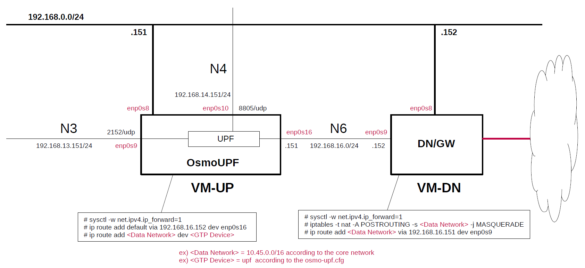

# Install OsmoUPF on Host
This briefly describes the steps and configuration to install [OsmoUPF](https://gitea.osmocom.org/cellular-infrastructure/osmo-upf).
There are installation instructions in the OsmoUPF repository, but I would like to write down the steps for actually installing it.
**It is intended to be prepared for use with [Open5GS](https://github.com/open5gs/open5gs) and [free5GC](https://github.com/free5gc/free5gc).**

---

### [Sample Configurations and Miscellaneous for Mobile Network](https://github.com/s5uishida/sample_config_misc_for_mobile_network)

---

<a id="toc"></a>

## Table of Contents

- [Simple Overview of OsmoUPF and Data Network Gateway](#overview)
- [Install OsmoUPF on VM-UP](#install)
- [Setup OsmoUPF on VM-UP](#setup_up)
  - [Create configuration file](#conf)
- [Run OsmoUPF on VM-UP](#run)
- [Setup Data Network Gateway on VM-DN](#setup_dn)
- [Changelog (summary)](#changelog)

---

<a id="overview"></a>

## Simple Overview of OsmoUPF and Data Network Gateway

This describes a simple configuration of OsmoUPF and Data Network Gateway, focusing on U-Plane.
**Note that this configuration is implemented with Virtualbox VMs.**

The following minimum configuration was set as a condition.
- One UPF and Data Network Gateway

The built simulation environment is as follows.

</img>

The OsmoUPF used is as follows.
- UPF - OsmoUPF v0.1.1.109 (2024.09.22) - https://gitea.osmocom.org/cellular-infrastructure/osmo-upf

Each VMs are as follows.  
| VM | SW & Role | IP address | OS | CPU<br>(Min) | Mem<br>(Min) | HDD<br>(Min) |
| --- | --- | --- | --- | --- | --- | --- |
| VM-UP | OsmoUPF U-Plane | 192.168.0.151/24 | Ubuntu 24.04 | 1 | 1GB | 10GB |
| VM-DN | Data Network Gateway  | 192.168.0.152/24 | Ubuntu 24.04 | 1 | 1GB | 10GB |

The network interfaces of each VM are as follows.
| VM | Device | Network Adapter | IP address | Interface |
| --- | --- | --- | --- | --- |
| VM-UP | ~~enp0s3~~ | ~~NAT(default)~~ | ~~10.0.2.15/24~~ | ~~(VM default NW)~~ ***down*** |
| | enp0s8 | Bridged Adapter | 192.168.0.151/24 | (Mgmt NW) |
| | enp0s9 | NAT Network | 192.168.13.151/24 | N3 |
| | enp0s10 | NAT Network | 192.168.14.151/24 | N4 |
| | enp0s16 | NAT Network | 192.168.16.151/24 | N6 |
| VM-DN | enp0s3 | NAT(default) | 10.0.2.15/24 | (VM default NW) |
| | enp0s8 | Bridged Adapter | 192.168.0.152/24 | (Mgmt NW) | -- |
| | enp0s9 | NAT Network | 192.168.16.152/24 | N6, ***default GW for VM-UP*** |

NAT networks of Virtualbox  are as follows.
| Network Name | Network CIDR |
| --- | --- |
| N3 | 192.168.13.0/24 |
| N4 | 192.168.14.0/24 |
| N6 | 192.168.16.0/24 |

**Note. Virtualbox GUI tool can only register up to 4 Network Adapters in one VM.
Since 5 Network Adapters are registered in VM-UP, one cannot be registered with the GUI tool.
In this case, directly edit the vbox file as follows and register the remaining Network Adapter.**

**For example)**
```diff
--- osmo-upf-21.vbox.orig       2024-09-22 20:52:34.031874864 +0900
+++ osmo-upf-21.vbox    2024-09-23 08:34:15.806358702 +0900
@@ -67,10 +67,11 @@
           </DisabledModes>
           <NATNetwork name="N4"/>
         </Adapter>
-        <Adapter slot="8" MACAddress="080027241A4F" cable="false">
+        <Adapter slot="8" enabled="true" MACAddress="080027241A4F" type="82540EM">
           <DisabledModes>
             <NAT localhost-reachable="true"/>
           </DisabledModes>
+          <NATNetwork name="N6"/>
         </Adapter>
         <Adapter slot="9" MACAddress="0800270602B1" cable="false">
           <DisabledModes>
```

<a id="install"></a>

## Install OsmoUPF on VM-UP

This discribes the package installation of Nightly Builds on Ubuntu 24.04 with reference to the following.
- OsmoUPF v0.1.1.109 (2024.09.22) - https://osmocom.org/projects/cellular-infrastructure/wiki/Binary_Packages

```
# wget https://obs.osmocom.org/projects/osmocom/public_key
# sha256sum public_key
51d8df2fcd8f6c857e0e7f7c936fe1fea6d69bc2671e3ddecb13c7656ca6a168  public_key
# mv public_key /etc/apt/trusted.gpg.d/osmocom.asc
# export OSMOCOM_REPO="https://downloads.osmocom.org/packages/osmocom:/nightly/xUbuntu_24.04" 
# echo "deb [signed-by=/etc/apt/trusted.gpg.d/osmocom.asc] $OSMOCOM_REPO/ ./" | sudo tee /etc/apt/sources.list.d/osmocom-nightly.list
# apt update
# apt install osmo-upf
```

<a id="setup_up"></a>

## Setup OsmoUPF on VM-UP

Please refer to the following for setup OsmoUPF.
- OsmoUPF v0.1.1.109 (2024.09.22) - https://ftp.osmocom.org/docs/osmo-upf/master/osmoupf-usermanual.pdf

First, uncomment the next line in the `/etc/sysctl.conf` file and reflect it in the OS.
```
net.ipv4.ip_forward=1
```
```
# sysctl -p
```
Next, down the default interface`enp0s3` of the VM-UP and set the VM-DN IP address to default GW on the N6 interface`enp0s16`.
```
# ip link set dev enp0s3 down
# ip route add default via 192.168.16.152 dev enp0s16
```

<a id="conf"></a>

### Create configuration file

Create `/root/osmocom` directory and put the configuration file there.

- `/root/osmocom/osmo-upf.cfg`

**Note. The GTP Device is set to `upf` and the Network Instance is set to `internet`.**
```
log stderr
 logging filter all 1
 logging color 1
 logging print category-hex 0
 logging print category 1
 logging timestamp 0
 logging print file basename last
 logging print level 1
 logging level set-all notice

timer pfcp x24 5000
pfcp
 local-addr 192.168.14.151
tunend
 dev create upf 192.168.13.151
netinst
 add internet 192.168.13.151
```

<a id="run"></a>

## Run OsmoUPF on VM-UP

Here, stop `osmo-upf.service` and run `osmo-upf` manually.

```
# systemctl stop osmo-upf.service
# systemctl disable osmo-upf.service
# cd /root/osmocom
# osmo-upf -c osmo-upf.cfg
Added GTP device upf on 192.168.13.151 (create new)
20240923104833428 DLGLOBAL NOTICE Available via telnet 127.0.0.1 4275 (telnet_interface.c:88)
20240923104833429 DLCTRL NOTICE CTRL at 127.0.0.1 4276 (control_if.c:1024)
20240923104833429 DGTP NOTICE Opened mnl_socket (upf_gtp.c:306)
20240923104833432 DGTP NOTICE upf 192.168.13.151:2152: created GTP device (upf_gtp.c:250)
20240923104833433 DGTP NOTICE upf [9] 192.168.13.151:2152: GTP device ready (ifidx=9) (upf_gtp.c:177)
20240923104833440 DNFT NOTICE Created nft table "osmo-upf" (upf_nft.c:115)
20240923104833445 DLPFCP NOTICE PFCP endpoint: recovery timestamp = 0xea9b4771 (1727056113 seconds since UNIX epoch, which is 3936044913 seconds since NTP era 0; IETF RFC 5905) (pfcp_endpoint.c:155)
20240923104833446 DLPFCP NOTICE PFCP: Listening on 192.168.14.151:8805 (upf.c:107)
```
The link status of the GTP Device `upf` is as follows.
```
# ip link show
...
8: upf: <POINTOPOINT,MULTICAST,NOARP,UP,LOWER_UP> mtu 1452 qdisc noqueue state UNKNOWN mode DEFAULT group default qlen 1000
    link/none 
...
```
Then, set the routing to the `<Data Network>` for the `<GTP Device>`.
```
# ip route add <Data Network> dev <GTP Device>
```
**Note. Set `<Data Network>` according to the core network and `<GTP Device>` according to the `osmo-upf.cfg`.  
ex) `<Data Network>=10.45.0.0/16, <GTP Device>=upf`**

<a id="setup_dn"></a>

## Setup Data Network Gateway on VM-DN

First, uncomment the next line in the `/etc/sysctl.conf` file and reflect it in the OS.
```
net.ipv4.ip_forward=1
```
```
# sysctl -p
```
Next, configure NAPT and routing to N6 IP address of OsmoUPF.
```
# iptables -t nat -A POSTROUTING -s <Data Network> -j MASQUERADE
# ip route add <Data Network> via 192.168.16.151 dev enp0s9
```
**Note. Set `<Data Network>` according to the core network.  
ex) `10.45.0.0/16`**

---
With the above steps, OsmoUPF has been constructed.
You will be able to work OsmoUPF with Open5GS and free5GC.
I would like to thank the excellent developers and all the contributors of OsmoUPF and so.

<a id="changelog"></a>

## Changelog (summary)

- [2024.09.23] Initial release.
